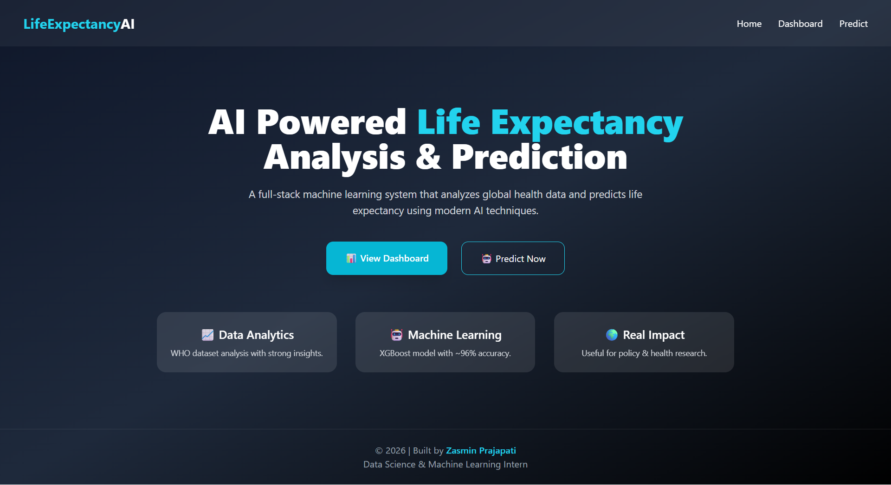
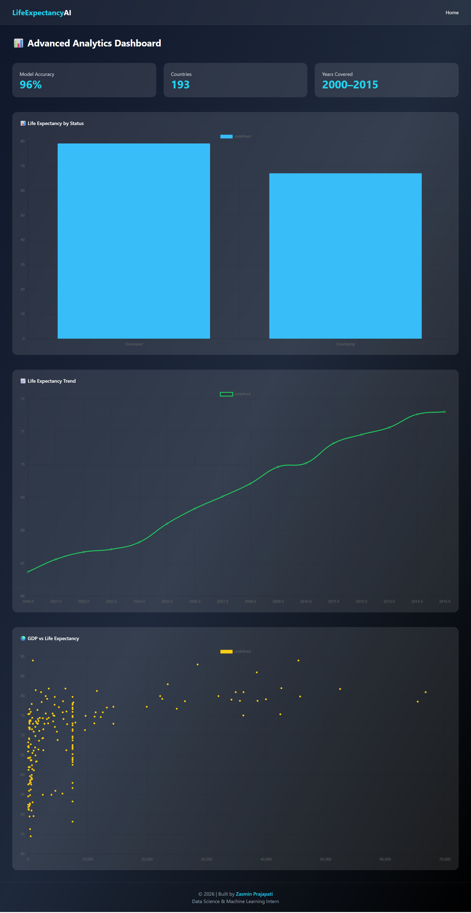
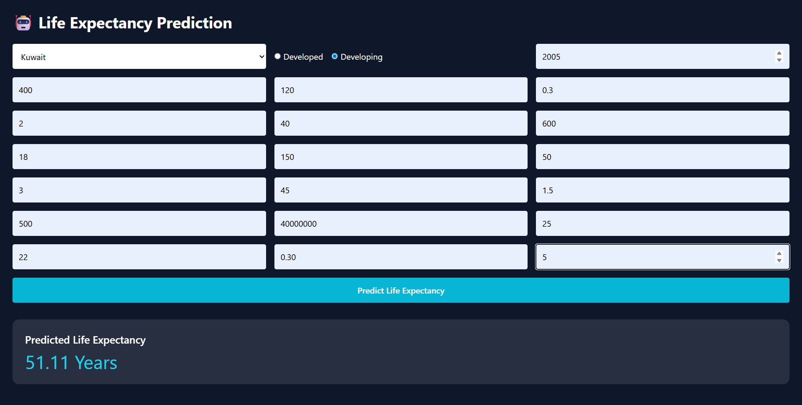

# 🚀 AI Powered Life Expectancy Analysis & Prediction

  
  
  
  

  <b>A full-stack AI web application that analyzes global health data and predicts life expectancy using modern machine learning and an animated dashboard.</b>

---

## 👨‍💻 Author

**Zasmin Prajapati**  
Data Science | Machine Learning Intern  

---

## 📌 Project Overview

Life expectancy varies significantly across countries due to differences in health, education, and economic conditions.  
This project leverages the **WHO Life Expectancy Dataset (2000–2015)** to build an end-to-end AI system that:

- Performs detailed **Exploratory Data Analysis (EDA)**
- Trains a high-accuracy **Machine Learning model**
- Deploys predictions using a **Flask web application**
- Presents insights through a **modern, animated analytics dashboard**

---

## ✨ Key Features

- End-to-end Machine Learning pipeline
- Real-world WHO dataset analysis
- XGBoost regression model with **~96% R² accuracy**
- Flask backend with clean architecture
- Modern UI with **glassmorphism & animations**
- Interactive charts using **Chart.js**
- Real-time life expectancy prediction
- Internship & portfolio ready

---

## 🧠 Machine Learning Details

- **Algorithms Used**
  - Random Forest Regressor
  - XGBoost Regressor (Final Model)

- **Evaluation Metrics**
  - R² Score ≈ **0.96**
  - RMSE ≈ **2 years**

- **Target Variable**
  - Life Expectancy (Years)

---

## 📊 Dashboard Analytics

The dashboard provides multiple animated visualizations:

- 📊 Bar Chart – Life Expectancy by Country Status  
- 📈 Line Chart – Life Expectancy Trend (2000–2015)  
- 🌍 Scatter Plot – GDP vs Life Expectancy  
- 🥧 Pie Chart – Developed vs Developing Countries  
- 🍩 Doughnut Chart – Average Health Indicators  
- 🕸 Radar Chart – Feature Influence Comparison  

---

## 🖥️ Application Screenshots

### Home Page

### Analytics Dashboard

### Prediction Page

---

## 🛠 Tech Stack

| Layer | Technology |
|-----|-----------|
| Language | Python |
| Backend | Flask |
| Machine Learning | Scikit-learn, XGBoost |
| Data Processing | Pandas, NumPy |
| Frontend | HTML, Tailwind CSS |
| Charts | Chart.js |
| UI Design | Glassmorphism + Animations |
| Tools | VS Code, Git, GitHub |

---

## 📂 Project Structure

